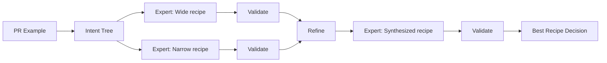

# OpenRewrite Recipe Assistant

*AI-powered automated refactoring at scale through example-driven recipe generation*

[→ Next: Architecture](./docs/ARCHITECTURE.md) | [→ Next: Validation Algorithm](./docs/VALIDATION.md) | [→ Next: Evaluation Infrastructure](./docs/EVALUATION.md)

---

## Table of Contents

1. [Problem Statement](#problem-statement)
2. [Solution](#solution)
3. [Known Limitations](#known-limitations)
4. [Getting Started](#getting-started)
5. [System Architecture](#system-architecture)
6. [Evaluation Architecture](#evaluation-architecture)
7. [Project Structure](#project-structure)
8. [Main Techniques](#main-techniques)
9. [Anthropic Research Connections](#anthropic-research-connections)
10. [Lessons Learned](#lessons-learned)
11. [Future Plans](#future-plans)

---

## Problem Statement

**LLM Limitations:** While LLMs excel at code understanding, they struggle with large-scale refactoring automation. 
Direct LLM-based refactoring is getting better and better, but it still produces non-deterministic output (smaller issue) 
and fails when applying consistent changes across many files. In my experience with Sonnet 4.5 applying the same changes over ~30, it
tries to hack a script to do that. That is much more brittle than OpenRewrite recipe. It's very hard to convince it to just
go through each file and apply changes manually.

**Platform Engineering Challenge:** OpenRewrite is a powerful framework for automated refactoring, but its steep learning curve
prevents many teams from leveraging it effectively. Composing recipes requires deep framework knowledge, forcing platform engineers
to spend time learning OpenRewrite internals instead of solving business problems.

**This Project:** Bridges the gap by using LLMs for intelligent recipe composition while leveraging OpenRewrite for deterministic execution.
Empirical validation with precision/recall metrics ensures quality, and iterative refinement learns from measurable feedback to generate production-ready recipes.

---

## Solution

This system generates OpenRewrite recipes automatically from Pull Request examples through a 6-phase multi-agent workflow:

1. **Repository Setup** - Clone repos, fetch PR branches, extract ground truth diff
2. **Intent Extraction** - Analyze PR changes to build hierarchical intent tree
3. **Recipe Mapping** - Expert subagents generate recipes to achieve the intents
4. **Empirical Validation** - Execute recipes in isolated environments, measure precision/recall via diff comparison
5. **Iterative Refinement** - Synthesize improved recipe learning from validation gaps
6. **Best Selection** - Choose highest F1-score recipe with quantified effectiveness



**Key Differentiators:**
- **Empirical validation** - Deterministic precision/recall metrics, not LLM-based evaluation
- **Iterative refinement** - 66% F1-score improvement through in-session learning
- **Multi-query RAG** - Recall improvement via Reciprocal Rank Fusion and intelligent query rewording
- **Production-ready** - 100% workflow success rate, systematic quality tracking

**Latest Results:** 85% average F1-score, $5.42 cost per run. ([Eval pipeline](https://github.com/glebmish/rewrite-claude-assisted/actions/runs/19775262059))

---

## Known Limitations

Current implementation constraints:

- **JVM only** - Limited to Java/Kotlin projects (OpenRewrite supports other languages, but workflow optimized for JVM)
- **Gradle only** - Verification is based on Gradle init script and doesn't support other environments
- **Recipe composition only** - Cannot implement custom code recipes, only composes existing recipes. That reduced effectiveness
for complicated code refactorings.

These constraints represent opportunities for future enhancement rather than fundamental design limitations.

---

## Getting Started

### Requirements

- Java 21
- Docker & Docker Compose
- Python 3.8+
- Claude Code CLI
- Git & GitHub CLI (`gh`)
- `yq`, `jq`

**Platforms:** Linux and macOS tested, Windows via WSL untested.

### Quick Setup

```bash
# Clone repository
git clone https://github.com/glebmish/rewrite-claude-assisted.git
cd rewrite-claude-assisted

# One-command setup (installs MCP server, pulls DB image)
./scripts/quick-setup.sh
```

### Example Execution

```bash
# Interactive mode
claude
> /rewrite-assist https://github.com/openrewrite-assist-testing-dataset/simple-blog-platform/pull/3

# Non-interactive mode
claude -p "/rewrite-assist https://github.com/openrewrite-assist-testing-dataset/simple-blog-platform/pull/3"
```

**Expected Output:** 15+ artifacts in `.output/<timestamp>/` including recipe candidates (`option-1-recipe.yaml`, `option-2-recipe.yaml`, `option-3-recipe.yaml`), precision/recall metrics (`*-stats.json`), and final recommendation in `result/recommended-recipe.yaml`.

See [eval-checkpoints/2025-11-29-sonnet-with-mcp/4-run1-run-metadata/](eval-checkpoints/2025-11-29-sonnet-with-mcp/4-run1-run-metadata/) for a perfect match example.

---

## System Architecture

**Key Components:**
- **Main Orchestrator** - `/rewrite-assist` slash command coordinates 6-phase workflow with context isolation
- **MCP Server** - PostgreSQL + pgvector with 1000+ recipe embeddings, multi-query semantic search
- **Expert Agent** - Discovers recipes via MCP, composes alternatives using wide/narrow strategies
- **Validator Agent** - Executes recipes in isolated environments, calculates empirical precision/recall metrics

See [docs/ARCHITECTURE.md](docs/ARCHITECTURE.md) for detailed system design including data flow, agent orchestration, and scalability considerations.

---

## Evaluation Architecture

**Methodology:** Non-interactive workflow execution with empirical diff-based validation. Each run executes recipes on clean repository copies, compares output to PR ground truth, and calculates deterministic precision/recall metrics.

**Latest Results (2025-11-29):**
- **Average F1-Score:** 0.85
- **Average Precision:** 0.90
- **Average Recall:** 0.82
- **Perfect Matches:** 1/5 (20%)
- **Workflow Success Rate:** 100% (5/5)
- **Average Cost:** $5.42 per run
- **Average Duration:** 16.7 minutes

### Evolution Across 5 Checkpoints

| Checkpoint | Date | F1 | Cost | Key Change                                                               |
|------------|------|-------|------|--------------------------------------------------------------------------|
| 2025-11-01 | Nov 1 | n/a | $3.82 | Baseline (Haiku) - hallucinates and fails to perform empirical validation |
| 2025-11-17 | Nov 17 | 0.52 | $4.28 | Sonnet + validations fixes - performs real validation                    |
| 2025-11-23 | Nov 23 | 0.54 | $4.15 | Context optimization (-35% tokens)                                       |
| 2025-11-25 | Nov 25 | 0.51 | $4.13 | MCP integration                                                          |
| **2025-11-29** | **Nov 29** | **0.85** | **$5.42** | **Refinement phase (+66% F1)**                                           |

See [docs/VALIDATION.md](docs/VALIDATION.md) for validation algorithm details

See [docs/EVALUATION.md](docs/EVALUATION.md) for evaluation algorithm details

---

## Project Structure

```
rewrite-claude-assisted/
├── .claude/
│   ├── commands/          # /setup-assistant, /create-recipe, /rewrite-assist, /fetch-repos, /extract-intent, /analyze-session
│   └── agents/            # openrewrite-expert, openrewrite-recipe-validator, session-evaluator
├── mcp-server/            # Custom MCP server with semantic search
│   ├── src/               # Python MCP implementation
│   └── scripts/           # Setup, startup scripts
├── data-ingestion/        # Recipe database pipeline (15-20 min full build)
├── eval/                  # Non-interactive workflow runner, test suite definitions
├── eval-checkpoints/      # Historical checkpoints with complete artifacts
├── scripts/               # Scripts used for setup, workflow execution and workflow analysis
└── docs/
│   ├── ARCHITECTURE.md    # System design deep-dive including refinement
│   ├── VALIDATION.md      # Empirical validation algorithm
│   ├── EVALUATION.md      # Evaluation algorithm
│   └── openrewrite.md     # Condensed OpenRewrite guide for user and LLM use
└── DEVELOPMENT_DIARY.md   # 6-month evolution log with insights
```

**Key Documentation:**
- **[ARCHITECTURE.md](docs/ARCHITECTURE.md)** - Agent orchestration, MCP integration, iterative refinement, workflow phases, design decisions
- **[VALIDATION.md](docs/VALIDATION.md)** - Diff parsing, change classification, metrics calculation, real examples
- **[EVALUATION.md](docs/EVALUATION.md)** - Evaluation algorithm, multi-agent cost tracking, batch pipeline orchestration, evolution tracking
- **[DEVELOPMENT_DIARY.md](DEVELOPMENT_DIARY.md)** - Evolution, challenges, learnings, manual review notes

---

## Main Techniques

### 1. Multi-Query RAG with Reciprocal Rank Fusion

**Problem:** (1) Reliance on WebSearch and WebFetch is expensive and unreliable. (2) Single semantic queries miss relevant recipes
due to phrasing variations and abstraction level differences.

**Solution:** For each refactoring intent, generate 2-5 query variations and fuse results using Reciprocal Rank Fusion (RRF).

**Example:**
```
Intent: "Migrate H2 database to PostgreSQL"
Queries:
  - "Migrate H2 database to PostgreSQL"  (original)
  - "Replace H2 with PostgreSQL"  (synonym)
  - "Change embedded database to PostgreSQL"  (abstraction)
  - "Database migration from H2"  (simplification)
```

**Impact:** Recall improvement over single-query search. Recipes appearing in multiple query results receive boosted scores, improving relevance.

### 2. Empirical Diff-Based Validation

**Problem:** LLM-based evaluation is unreliable for refactoring correctness - models can hallucinate success.

**Solution:** Execute recipes on actual code, capture output diffs, compare to PR ground truth at line level, calculate deterministic metrics.

**Process:**
1. Execute recipe in isolated repository copy
2. Extract unified diff of changes
3. Parse and normalize changes (file, type, content)
4. Match changes between PR and recipe output
5. Calculate: Precision = TP/(TP+FP), Recall = TP/(TP+FN), F1 = harmonic mean

**Advantages:**
- Reproducible metrics (same inputs → same results)
- No hallucination risk
- Quantifiable gaps (exact false positive/negative counts)
- Automated in CI/CD pipelines

### 3. Iterative Multi-Agent Refinement

**Problem:** Single-shot recipe generation faces precision/recall tradeoffs (wide strategies over-apply, narrow strategies miss changes).

**Solution:** Multi-iteration approach with empirical feedback:
- Generate 2 alternatives (wide + narrow strategies)
- Validate both empirically
- Analyze validation results for root causes
- Synthesize improved 3rd recipe combining strengths
- Validate Option 3 and select best F1-score

**Results:**
- F1-score: 0.51 → 0.85 (+66% improvement)
- Cost: \$4.13 → \$5.42 (+31% increase)
- First perfect match achieved (100% precision, 100% recall)

**Learning mechanisms:** Identifies over-aggressive recipes from false positives, fills coverage gaps from false negatives, switches between semantic and text-based recipes based on validation failures.

### 4. Custom MCP Integration

**Implementation:** PostgreSQL 16 + pgvector extension with 1000+ OpenRewrite recipe embeddings (384-dimensional, all-MiniLM-L6-v2 model).

**Features:**
- Multi-query semantic search with single MCP call
- Reciprocal Rank Fusion for ranking aggregation
- Sub-100ms query latency
- Docker-based deployment (510MB image, <5s startup)

**Tools Provided:**
- `find_recipes` - Semantic search supporting 1-5 query variations
- `get_recipe` - Fetch complete documentation
- `test_connection` - Health check

**Data Pipeline:** Automated ingestion from OpenRewrite docs, embedding generation, Docker image build (15-20 minutes full pipeline).

---

## Anthropic Research Connections

*This project implements patterns and principles from Anthropic's agent research in a real-world Platform Engineering context.*

### Core Architecture Patterns

**[Building Effective Agents](https://www.anthropic.com/engineering/building-effective-agents)** (Dec 2024)
- **Orchestrator-Workers**: Main orchestrator coordinates 6 phases with specialized expert/validator subagents
- **Evaluator-Optimizer**: Phase 5 refinement - validator evaluates recipes, expert synthesizes improvements

**[Multi-Agent Research System](https://www.anthropic.com/engineering/multi-agent-research-system)** (Jun 2025)
- **Token consumption tradeoff**: Article notes 15× cost increase; this project's refinement increased costs 31% for 66% F1 improvement - validating the ROI
- **Parallelization impact**: Phase 3 & 4 parallel execution directly inspired by this research
- **Tool descriptions matter**: MCP multi-query search addresses recipe discovery recall

**[Effective Harnesses for Long-Running Agents](https://www.anthropic.com/engineering/effective-harnesses-for-long-running-agents)** (Nov 2025)
- **Progress tracking**: Multi-file output and validation stats mirror recommended `progress.txt` pattern
- **Git-based state**: Validation agent's isolated repos and diff-based metrics align with recommended patterns
- **Structured task breakdown**: Intent tree extraction (Phase 2) creates systematic feature decomposition
- **Session isolation**: Non-interactive evaluation mode implements session-based execution with artifact persistence

### Context Management & Optimization

**[Effective Context Engineering](https://www.anthropic.com/engineering/effective-context-engineering-for-ai-agents)** (Sep 2025)
- **Sub-agent architecture**: Phase 3 & 4 parallel execution with specialized agents returning condensed summaries
- **Just-in-time retrieval**: MCP server implements on-demand recipe lookup vs. pre-loading all 1000+ recipes
- **Structured note-taking**: Multi-file output strategy (`.output/<timestamp>/`) serves as external memory across phases
- **"Context rot" mitigation**: Context optimization improved both cost AND quality simultaneously

**[Code Execution with MCP](https://www.anthropic.com/engineering/code-execution-with-mcp)** (Nov 2025)
- **Token reduction**: Replaced WebSearch/WebFetch with local MCP server (sub-100ms latency)
- **Progressive disclosure**: Multi-query semantic search loads only relevant recipes, not full catalog
- **Data filtering**: Validation agent filters recipe output through empirical diff comparison before returning metrics

### Knowledge Retrieval & Tool Design

**[Contextual Retrieval](https://www.anthropic.com/engineering/contextual-retrieval)** (Sep 2024)
- **Multi-query approach**: Reciprocal Rank Fusion with 2-5 query variations directly applies these principles
- **Contextual embeddings**: Recipe embeddings include full documentation context, not just titles
- **Cost efficiency**: Upfront embedding investment justified by sub-100ms query latency

**[Writing Effective Tools for Agents](https://www.anthropic.com/engineering/writing-tools-for-agents)** (Sep 2025)
- **High-signal responses**: Validation agent returns quantified precision/recall metrics, not verbose output
- **Token efficiency**: MCP `find_recipes` implements pagination/filtering (limit=5, min_score=0.5 defaults)
- **Natural language identifiers**: Recipe IDs like `org.openrewrite.java.spring.boot3.UpgradeSpringBoot_3_0` are semantic
- **Clear descriptions**: MCP tool documentation specifies single vs. array query patterns explicitly

---

## Lessons Learned

*6 months of intensive Claude Code development for production AI workflows*

### What Worked Well

**Multi-file output**
- Reduces context pollution and file edit errors 
- Easier to read
- Better control on the size of the files
- Requires more upfront thought about the structure and expected content

**Multi-Agent Orchestration**
- Each agent does its job better and doesn't fill main agent context
- Context isolation prevents artifact contamination between phases
- Parallel execution (Phase 3 & 4) improves latency without correctness tradeoffs
- File-based state management cleaner than in-memory passing

**Empirical Validation**
- Deterministic metrics enable measurable learning loops
- Ground truth from code execution eliminates hallucination risk
- Quantified gaps more actionable than subjective evaluation
- Automated validation in CI/CD with reproducible results

**MCP Integration**
- Custom MCP server unlocks domain-specific knowledge (1000+ recipes)
- Cheaper, faster, safer than using WebFetch and WebSearch
- Multi-query support further improves recall

**Iterative Refinement**
- 66% F1 improvement worth the +31% cost increase
- Empirical feedback more valuable than theoretical analysis

### Challenges Encountered

**File System Navigation**
- Early versions struggled with `cd` navigation and directory tracking
- **Workaround:** Explicit `pwd` usage, absolute paths, avoided complex worktrees
- Still occasionally lost working directory context across subagent calls

**Tool Reliability**
- Edit tool failures with non-unique patterns required larger context or Write tool fallback
- Bash redirects (`>`, `>>`) occasionally used despite explicit constraints in prompts
- Complex pipe chains sometimes failed requiring decomposition into simpler commands
- **Suggested Claude Code improvement** - Append tool for file edits that doesn't require passing a unique string for edit

**Session Management**
- No session id context available inside the session
- No native cost tracking in non-interactive use required workarounds
- **Solution:** Custom script to extract session ID from logs, calculate costs from usage data
- **Suggested Claude Code improvement** - Native per-session token usage and cost breakdown
- No ability to fail fast on the workflow with shell-native context (exit codes)
- **Suggested Claude Code improvement** - Allow agent to exit with specific codes (controlled by prompts), and a reserved exit code for session limit errors.
- Multiple commands to same subagent instance for iterative conversations - even though it's supposed to be supported, didn't happen even with explicit prompts.

**Progress observability**
- No progress logs in non-interactive use
- **Solution:** Custom Log MCP that writes to a file while eval script `tail -f` this file
- **Suggested Claude Code improvement** - native Log tool for non-interactive sessions
- Very limited visualization of subagents in interactive use - hard to troubleshoot
- **Suggested Claude Code improvement** - Tabs or panels showing subagent work in progress. Ideally, with an ability to directly chat with subagent

---

## Future Plans

- Test with Opus 4.5 - not available on Pro subscription
- Enable and test file-based recipe search - Clone relevant recipe repos and let agent use it for discovery
- Manually explore OpenRewrite docs and provide guidance on what recipes should be used to fill the gaps in recipes (text modification, etc)
- More refinement iterations
- Dynamic dependency detection mapping recipes to required Maven coordinates. Removes the need to maintain do-it-all Gradle plugin
that either misses most of the dependencies or pull a lot of unused dependencies.
- Complete automation loop: PR example → recipe generation → testing → deployment
- Code recipe implementation - much more powerful, but the code is very difficult

---

[→ Next: Architecture](./docs/ARCHITECTURE.md) | [→ Next: Validation Algorithm](./docs/VALIDATION.md) | [→ Next: Evaluation Infrastructure](./docs/EVALUATION.md)
