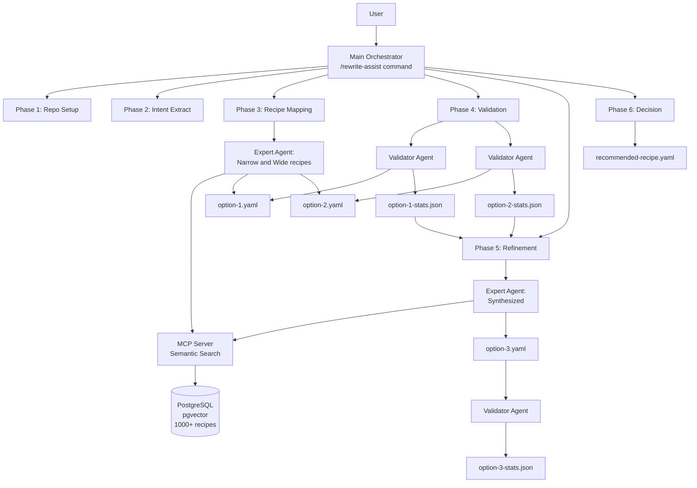
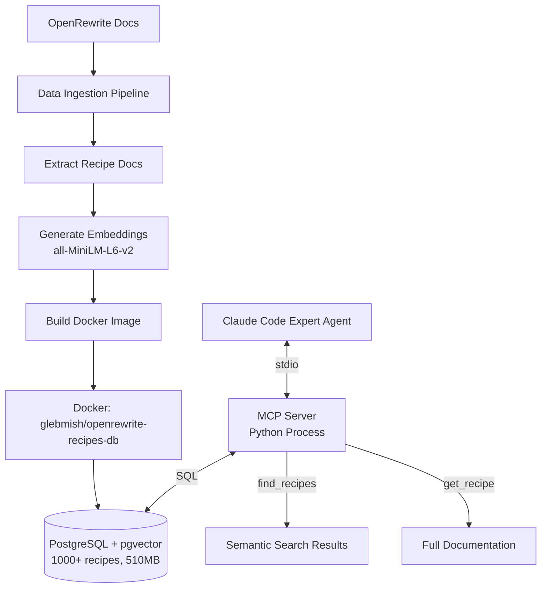

# Architecture Documentation

*Technical deep-dive into the OpenRewrite Recipe Assistant system design*

[← Back: README](../README.md) | [→ Next: Validation Algorithm](VALIDATION.md) | [→ Next: Evaluation Infrastructure](EVALUATION.md)

---

## Table of Contents

1. [System Overview](#system-overview)
2. [Agent Orchestration](#agent-orchestration)
3. [MCP Integration](#mcp-integration)
4. [Multi-Query RAG Design](#multi-query-rag-design)
5. [Validation Pipeline](#validation-pipeline)
6. [Iterative Refinement](#iterative-refinement)
7. [Artifact Management](#artifact-management)
8. [Design Decisions](#design-decisions)
9. [Summary](#summary)

---

## System Overview

### High-Level Architecture



### Data Flow

```
GitHub PR URL
  → Clone repositories (main + PR branch)
  → Extract hierarchical intent tree from diff
  → Semantic search for recipes (multi-query RAG)
  → Compose 2 recipe alternatives
  → Empirical validation (execute + measure precision/recall)
  → Refine based on validation gaps
  → Select best recipe
  → Output: YAML recipe + diff + metrics
```

### Key Components

| Component | Purpose | Implementation |
|-----------|---------|----------------|
| Main Orchestrator | Coordinates 6-phase workflow | `/rewrite-assist` slash command |
| Expert Agent | Recipe discovery & composition | `.claude/agents/openrewrite-expert.md` |
| Validator Agent | Empirical recipe testing | `.claude/agents/openrewrite-recipe-validator.md` |
| MCP Server | Semantic recipe search | `mcp-server/src/server.py` |
| Validation Script | Isolated recipe execution | `scripts/validate-recipe.sh` |
| Diff Analyzer | Precision/recall calculation | `scripts/analysis/analyze_diffs.py` |

---

## Agent Orchestration

### Main Orchestrator

**File:** `.claude/commands/rewrite-assist.md`

**Responsibilities:**
- Parse PR URLs from user input
- Coordinate phase execution (sequential, blocking)
- Manage artifact directory structure
- Pass context between phases
- Enforce completion criteria

**Context Isolation Strategy:**
- Main orchestrator maintains minimal state (file paths, PR metadata)
- Each subagent receives focused context via artifacts

**State Management:**
- State persisted as files in `.output/<timestamp>/`
- Subagents read previous phase artifacts
- No shared memory or global state

### Specialized Subagents

#### OpenRewrite Expert Agent

**File:** `.claude/agents/openrewrite-expert.md`

**Model:** Sonnet (reasoning-heavy task)

**Capabilities:**
1. **Intent Analysis:** Read `intent-tree.md`, categorize transformations
2. **Recipe Discovery:** Multi-query semantic search via MCP
3. **Coverage Analysis:** Identify gaps between intents and recipes
4. **Composition:** Build layered recipe YAML from discovered recipes
5. **Documentation:** Explain composition strategy

**Search Strategy:**
- **Wide approach:** Broad migration recipes (e.g., `UpgradeSpringBoot_3_0`)
- **Narrow approach:** Specific targeted recipes (e.g., `ChangePropertyKey`)
- Both strategies generate 2-5 query variations per intent

**Output Artifacts:**
- `option-N-recipe.yaml` - Executable OpenRewrite recipe
- `option-N-creation-analysis.md` - Composition rationale

#### Validator Agent

**File:** `.claude/agents/openrewrite-recipe-validator.md`

**Model:** Sonnet (precision-critical task)

**Capabilities:**
1. **Empirical Execution:** Run recipes via `validate-recipe.sh`
2. **Diff Capture:** Extract recipe output as unified diff
3. **Precision Measurement:** Execute `analyze_diffs.py`
4. **Gap Analysis:** Identify false positives and false negatives

**Execution Philosophy:**
- **Empirical-first:** Never do theoretical validation
- **Fail-fast:** Report failures immediately, don't work around
- **Isolation:** Every test in clean repository copy

**Output Artifacts:**
- `option-N-recipe.diff` - Recipe execution output
- `option-N-stats.json` - Precision/recall/F1 metrics
- `option-N-validation-analysis.md` - Analysis of results

### Parallel vs Sequential Execution

**Parallel (Phase 3 & 4):**
- Option 1 & Option 2 creation: independent
- Option 1 & Option 2 validation: independent
- **Tool:** Multiple Task tool invocations in single message

**Sequential (Phase 5):**
- Must wait for Option 1 & 2 validation to complete
- Analyzes both results before creating Option 3

**Trade-off:** Parallelization reduces latency but increases peak token usage

---

## MCP Integration

### Architecture & Data Pipeline



**Pipeline Duration:** 15-20 minutes for full rebuild from [OpenRewrite source](https://github.com/openrewrite/rewrite-recipe-markdown-generator) to Docker deployment.

### Implementation

**Server:** `mcp-server/src/server.py` - Python MCP package with stdio transport, psycopg2 + pgvector extension

**Database Schema:**
```sql
-- Core recipe table
CREATE TABLE recipes (
  id SERIAL PRIMARY KEY,
  recipe_name VARCHAR(500) UNIQUE NOT NULL,
  markdown_doc TEXT NOT NULL,
  created_at TIMESTAMP DEFAULT NOW(),
  updated_at TIMESTAMP DEFAULT NOW()
);

-- Separate embeddings table
CREATE TABLE recipe_embeddings (
  id SERIAL PRIMARY KEY,
  recipe_id INTEGER REFERENCES recipes(id) ON DELETE CASCADE,
  embedding vector(384),  -- all-MiniLM-L6-v2 384-dim embeddings
  embedding_model VARCHAR(200),
  created_at TIMESTAMP DEFAULT NOW(),
  UNIQUE(recipe_id, embedding_model)
);

-- HNSW index for fast vector similarity search
CREATE INDEX idx_recipe_embeddings_vector
  ON recipe_embeddings USING hnsw (embedding vector_cosine_ops)
  WITH (m = 16, ef_construction = 64);
```

**Docker Deployment:** Image `glebmish/openrewrite-recipes-db:latest` based on `pgvector/pgvector:pg16`, pre-loaded with embeddings (~510MB), <5s startup.

### MCP Tools

**1. test_connection** - Health check with optional echo message. Returns `{"status": "ok", "server_version": "1.0.0"}`.

**2. find_recipes** - Semantic search supporting single query or 2-5 variations for improved recall.

Parameters:
- `intent` (string | array): Query or query variations
- `limit` (int, default=5): Results per query
- `min_score` (float, default=0.5): Cosine similarity threshold

Multi-query example:
```python
{
  "intent": ["Migrate H2 to PostgreSQL", "Replace H2 with PostgreSQL",
             "Change embedded database to PostgreSQL"],
  "limit": 5
}
```

Algorithm: Reciprocal Rank Fusion (RRF) with k=60 constant. For each query variation, perform semantic search and fuse rankings: `fusion_score[recipe] += 1 / (60 + rank)`. Recipes appearing in multiple query results receive boosted scores.

**3. get_recipe** - Fetch complete documentation for a recipe by fully qualified ID.

### Data Ingestion Pipeline

**Script:** `data-ingestion/scripts/run-full-pipeline.sh`

**Steps:**
1. Clone recipe generator repository
2. Run Gradle task to generate markdown docs + metadata
3. Extract structured recipe data
4. Generate embeddings with SentenceTransformer (`all-MiniLM-L6-v2`)
5. Build Docker image with PostgreSQL + pre-loaded data

---

## Multi-Query RAG Design

### Problem

Single semantic queries miss relevant recipes due to phrasing variations ("migrate to Spring Boot 3" vs "upgrade Spring Boot"), abstraction level differences ("Change H2 to PostgreSQL" vs "Replace dependency"), and domain terminology variations ("Jakarta namespace" vs "javax to jakarta").

### Solution: Query Expansion with RRF

**Step 1: Query Generation** - For each intent, expert agent generates 2-5 variations by simplifying, generalizing, rewording, and stripping context.

Example:
```
Intent: "Migrate H2 database to PostgreSQL"
Variations:
  1. "Migrate H2 database to PostgreSQL"  (original)
  2. "Replace H2 with PostgreSQL"  (synonym)
  3. "Change embedded database to PostgreSQL"  (abstraction)
  4. "Database migration from H2"  (simplification)
```

**Step 2: Parallel Semantic Search** - Execute all queries in single MCP call, collecting results from each variation.

**Step 3: Reciprocal Rank Fusion** - Fuse rankings from multiple queries using RRF (k=60 constant from IR research, balances top vs lower-ranked results): `scores[recipe] += 1 / (60 + rank)`.

**Step 4: De-duplication** - Recipes appearing in multiple query results get boosted scores.

### Impact

Improved recall, more chances to find relevant non-semantical recipe (e.g. `replace yaml key` for github actions change) 

---

## Validation Pipeline

### Isolated Execution

**Script:** `scripts/validate-recipe.sh` - Executes recipes without contaminating workspace using PID-based repository copies (`repo-$$`). Automatic cleanup via trap ensures no interference between parallel validations.

### Java Version Management

Auto-detects Java version from `build.gradle` (sourceCompatibility/targetCompatibility/languageVersion) and sets appropriate JAVA_HOME for execution, since OpenRewrite recipes may behave differently across versions.

```bash
JAVA_HOME="/usr/lib/jvm/java-${JAVA_VERSION}-openjdk-amd64" ./gradlew rewriteRun \
  -Drewrite.activeRecipes=<recipe-name> --init-script rewrite.gradle --no-daemon
```

### Recipe Execution

**Gradle Init Script** (`rewrite.gradle`): [rewrite.gradle](../scripts/rewrite.gradle)

**Diff Capture:** `git add -A && git diff --cached --output=$OUTPUT_DIFF` captures all changes including new/deleted files.

### Precision/Recall Calculation

**Script:** `scripts/analysis/analyze_diffs.py`

Process: Parse PR diff and recipe diff → Normalize changes (remove line numbers) → Match changes → Calculate TP, FP, FN → Precision = TP/(TP+FP), Recall = TP/(TP+FN), F1 = harmonic mean.

See [VALIDATION.md](VALIDATION.md) for detailed algorithm including preprocessing, change classification, and edge cases.

---

## Iterative Refinement

### Motivation

Single-shot recipe generation faces precision/recall tradeoffs: wide strategies (broad migration recipes) achieve high recall but low precision (over-application), while narrow strategies (targeted recipes) achieve high precision but low recall (miss edge cases). Can we combine the best of both?

**Solution:** Multiple passes with empirical feedback - generate 2 alternatives, validate empirically, analyze what worked/failed, synthesize improved 3rd recipe.

### Workflow

**Phase 1-4: Generate & Validate Alternatives**
- Option 1: Wide strategy (broad migration recipes)
- Option 2: Narrow strategy (specific targeted recipes)
- Validate both empirically, capture precision/recall metrics

**Phase 5: Refinement**

Expert agent analyzes validation results:
1. **Comparative Analysis** - Read all artifacts (stats.json, validation-analysis.md, creation-analysis.md), compare precision/recall
2. **Root Cause Identification** - Why did failures occur?
   - False positives: Over-aggressive recipes, wrong scope
   - False negatives: Missing transformations, failed semantic recipes
3. **Synthesis Strategy** - Design improved recipe
4. **Generate Option 3** - Compose improved recipe combining strengths
5. **Validate Option 3** - Measure final precision/recall

**Phase 6: Best Selection** - Choose highest F1-score from 3 options

### Effectiveness

**Measured Impact (2025-11-25 vs 2025-11-29):**

| Metric | Before | After | Change |
|--------|--------|-------|--------|
| Avg F1-Score | 0.51 | 0.85 | +66% |
| Avg Precision | 0.64 | 0.90 | +41% |
| Avg Recall | 0.49 | 0.82 | +67% |
| Avg Cost | $4.13 | $5.42 | +31% |
| Perfect Matches | 0/5 | 1/5 | First! |

**Case Study - simple-blog-platform (H2 → PostgreSQL):**
- Before: F1 0.70
- After: **F1 1.00** (perfect match - 100% precision, 100% recall)
- Key improvements: Fixed password field bug (text-based replacement), corrected indentation issues (explicit newlines), retained semantic recipes for GitHub Actions

---

## Artifact Management

### Directory Structure

```
.output/<yyyy-mm-dd-hh-MM>/
├── session-id.txt, pr-<number>.diff, intent-tree.md
├── option-{1,2,3}-recipe.yaml              # Recipe candidates
├── option-{1,2,3}-recipe.diff              # Execution outputs
├── option-{1,2,3}-stats.json               # Precision/recall metrics
├── option-{1,2,3}-creation-analysis.md     # Composition rationale
├── option-{1,2,3}-validation-analysis.md   # Gap analysis
└── result/
    ├── recommended-recipe.yaml, recommended-recipe.diff, pr.diff
```

**Handoff Pattern:** File-based state passing between phases. Main orchestrator writes summaries, subagents read previous phase artifacts. No in-memory state.

**Eval Collection:** GitHub Actions uploads entire `.output/<timestamp>/` for post-run analysis and historical tracking.

---

## Summary

This architecture demonstrates:
- **Multi-agent orchestration** with clear responsibility separation
- **Empirical validation** with deterministic metrics
- **Iterative refinement** learning from quantified feedback
- **Custom MCP integration** for domain-specific knowledge
- **Production-grade tooling** with comprehensive artifact collection

The system achieves 100% workflow success rate and 85% F1-score through systematic design focused on reproducibility, measurability, and continuous improvement.

---

[← Back: README](../README.md) | [→ Next: Validation Algorithm](VALIDATION.md) | [→ Next: Evaluation Infrastructure](EVALUATION.md)
