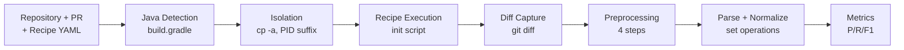

# Empirical Validation Algorithm

*Deterministic precision/recall metrics for recipe effectiveness*

[← Back: README](../README.md) | [← Back: Architecture](ARCHITECTURE.md) | [→ Next: Evaluation Infrastructure](EVALUATION.md)

---

## Table of Contents

1. [Problem Statement](#problem-statement)
2. [Validation Workflow](#validation-workflow)
3. [System Constraints](#system-constraints)
4. [Algorithm Overview](#algorithm-overview)
5. [Diff Parsing](#diff-parsing)
6. [Change Classification](#change-classification)
7. [Metrics Calculation](#metrics-calculation)
8. [Implementation](#implementation)
9. [Edge Cases & Limitations](#edge-cases--limitations)

---

## Problem Statement

### Why Deterministic Validation?

**Challenge:** How do we measure whether an AI-generated OpenRewrite recipe correctly automates a refactoring?

**Rejected Approach:** LLM-based evaluation
- "Does this recipe match the intent?" → Subjective, unreliable
- LLMs can hallucinate "yes" when the recipe is incomplete
- Not reproducible (different runs, different answers)
- No quantification of gaps

**Chosen Approach:** Empirical diff comparison
- Execute recipe on real code
- Compare recipe output to original PR changes
- Calculate precision/recall metrics
- Deterministic, reproducible, quantifiable

### Ground Truth Definition

**Ground Truth:** Original PR diff
- Shows exactly what changes the user wants to automate
- Generated by `git diff <default-branch> <pr-branch>`
- Represents the "perfect" automated refactoring

**Recipe Output:** Recipe execution diff
- Generated by executing OpenRewrite recipe on main branch
- Captured via `git diff` after `./gradlew rewriteRun`
- Represents what the recipe actually accomplishes

**Goal:** Measure how close recipe output is to ground truth

---

## Validation Workflow

### Java Version Detection

Validator reads project `build.gradle` to detect Java version from `sourceCompatibility`, `targetCompatibility`, or `languageVersion` fields.
Supported versions: 11, 17. Maps detected version to appropriate `JAVA_HOME` for recipe execution. Mismatch causes "Unsupported class file major version" error.

### Repository Isolation

Creates isolated repository copy using `cp -a` with unique PID suffix (`-rewrite-$$`) to prevent contamination of original repo.
Copies recipe YAML to isolated root as `rewrite.yml`. Git state reset via `git reset --hard HEAD`. Automatic cleanup via bash trap removes 
isolated copy on script exit (success or failure).

### Recipe Execution

Executes OpenRewrite via Gradle init script: `scripts/validate-recipe.sh` invokes `./gradlew rewriteRun -DrecipeName=<name> --init-script rewrite.gradle`.
Init script dynamically applies OpenRewrite plugin without modifying project build files. Recipe name passed via `-DrecipeName` system property.

This init script contains some of the OpenRewrite receipts as mvn dependencies. Recipes outside these modules may fail due to missing dependencies.

### Diff Capture

After recipe execution, excludes build artifacts via `.git/info/exclude`: gradlew, gradlew.bat, .gradle/, build/, rewrite.yml.
Captures all changes: `git add . && git diff --cached > output.diff`. This recipe diff becomes ground truth comparison input for analysis algorithm (Section 4 onward).

**Reference:** `scripts/validate-recipe.sh`, `scripts/rewrite.gradle`, `.claude/agents/openrewrite-recipe-validator.md:48-53`

---

## System Constraints

### Build System

**Gradle-only.** Validation uses Gradle init script (`--init-script` flag). Maven/other tools: not supported. Reason:
Init script pattern specific to Gradle extensibility.

### Recipe Dependencies

**Limited to bundled modules.** Init script includes some recipe modules (rewrite-all:1.23.0, rewrite-docker:2.14.0, etc). 
Custom recipes outside these may fail if dependencies missing. The only workaround currently is to add more dependencies to the init script.

### Platform

**Tested:** Linux, macOS. **Untested:** Windows (WSL may work).

### Language/File Types

**Supported:** Java, Docker files, GitHub Actions YAML, build files, properties files (via bundled modules).
**Not supported:** Non-JVM languages. Reason: Workflow optimized for JVM ecosystem.

### Java Versions

**Supported:** 11, 17, 21. Detected from build.gradle patterns. **Error:** "Unsupported class file major version" indicates wrong Java.

### Validation Exclusions

**Excluded files:** gradlew, gradlew.bat, rewrite.gradle (Gradle wrapper + temp init script, not application code). Applied at 3 levels:
OpenRewrite exclusions (init script line 57-61), git ignore (validation script line 159-175), diff preprocessing
(analyze_diffs.py line 17-23, see Section 5 preprocessing step 4).

**Reference:** `scripts/rewrite.gradle`, `scripts/validate-recipe.sh`, `scripts/analysis/analyze_diffs.py`

---

## Diff Parsing

### Input Format

**Unified Diff Format** (Git default): Standard Git diff with file headers, hunk markers (`@@`), and line prefixes (`+` for additions, `-` for removals).

### Preprocessing Pipeline

**Implementation:** `scripts/analysis/analyze_diffs.py`

**Steps:**

#### 1. Remove Binary File Diffs

**Problem:** Binary files (e.g., `.jar`) cause parser errors with "Binary files differ" markers.

**Solution:** Regex removes all binary diff blocks (from `diff --git` header through `Binary files` line).

#### 2. Deduplicate File Sections

**Problem:** OpenRewrite sometimes generates multiple diffs for the same file (e.g., gradle-wrapper.properties appears 3 times).

**Solution:** Keep only first occurrence of each file path. Extract path from `diff --git a/path b/path` header.

#### 3. Clean Malformed Hunk Headers

**Problem:** OpenRewrite appends recipe names after hunk headers: `@@ -1,7 +1,8 @@ com.yourorg.RecipeName`

**Solution:** Regex strips text after closing `@@`, leaving only: `@@ -1,7 +1,8 @@`

#### 4. Remove Excluded Files

**Excluded:** `gradlew`, `gradlew.bat`, `rewrite.gradle` (Gradle wrapper and temporary init scripts not part of application code).

### Change Extraction

**Library:** `unidiff` (Python package) parses cleaned diff into structured objects.

**Process:** Iterate through patch_set → files → hunks → lines. For each added line, create tuple: `(target_file, 'add', target_line_no, content)`. For removed lines: `(source_file, 'remove', source_line_no, content)`. Store in set.

**Output format:** `(file_path, change_type, line_number, content)` tuples in a set.

**Line numbers - dual purpose:**
1. **Deduplication:** Distinguish identical content at different positions in the set (e.g., two `import` statements with same text at lines 5 and 10 stored separately)
2. **Matching:** Removed during normalization for comparison, allowing same content at different line numbers to match

**File path handling:** `unidiff` preserves Git prefixes (`a/` for source, `b/` for target). Example: `'b/src/User.java'`. Both PR and recipe diffs use same convention, enabling correct matching.

---

## Change Classification

### Normalization for Matching

**Problem:** Line numbers differ between PR and recipe for semantically identical changes (e.g., same import at line 5 vs line 7 due to alphabetical sorting).

**Solution:** Normalize by dropping line numbers: `(file, type, line, content)` → `(file, type, content)`. This creates a normalized key for matching.

### Set Operations

**Build normalized lookups:** Parse both diffs into sets (`set_g` for PR, `set_r` for recipe). Group changes by normalized key into dictionaries (`pr_by_normalized`, `recipe_by_normalized`) where each normalized key maps to a list of original change tuples (preserving line numbers). Multiple changes with identical normalized form but different line numbers stored in same list.

**Compute set differences:** Extract normalized keys as sets. Compute `tp_keys = pr_keys ∩ recipe_keys` (both), `fn_keys = pr_keys - recipe_keys` (missed), `fp_keys = recipe_keys - pr_keys` (over-application).

### Handling Multiplicity

**Challenge:** Same normalized change appears multiple times at different line numbers (e.g., PR has 3 `import java.util.List;` at lines 5, 10, 15; recipe has 2 at lines 5, 11).

**Initial storage:** Sets distinguish by line numbers: 3 separate tuples in `set_g`, 2 in `set_r`.

**After grouping:** Same normalized key `('b/File.java', 'add', 'import java.util.List;\n')` maps to list of 3 instances in `pr_by_normalized`, list of 2 in `recipe_by_normalized`.

**Optimal matching:** For each `tp_key`, match `min(|pr_instances|, |recipe_instances|)` as TPs. Excess PR instances → FN (missed). Excess recipe instances → FP (over-application).

**Example result:** 2 TPs (matched), 1 FN (3rd import missed), 0 FP.

---

## Metrics Calculation

### Definitions

**True Positives (TP):**
- Changes present in both PR and recipe output
- "Recipe correctly made these changes"
- Count: Number of matched change instances

**False Positives (FP):**
- Changes in recipe output but NOT in PR
- "Recipe made changes it shouldn't have"
- "Errors of commission" / "Over-application"
- Count: Excess recipe changes

**False Negatives (FN):**
- Changes in PR but NOT in recipe output
- "Recipe missed these required changes"
- "Errors of omission" / "Coverage gaps"
- Count: Missed PR changes

### Formulas

**Precision:** `TP / (TP + FP)` if denominator > 0, else 0.0. Fraction of recipe changes that were correct. Range [0.0, 1.0]. Edge case: Zero predictions → 0.0 (not 1.0; perfect precision with no predictions is meaningless).

**Recall:** `TP / (TP + FN)` if denominator > 0, else 0.0. Fraction of required PR changes made by recipe. Range [0.0, 1.0]. Edge case: Zero expected changes → 0.0.

**F1-Score:** `2 × (P × R) / (P + R)` if denominator > 0, else 0.0. Harmonic mean of precision and recall. Range [0.0, 1.0]. 1.0 = perfect, 0.85+ = excellent, 0.5 = mediocre, 0.0 = failure.

**Perfect Match:** Boolean `(FP == 0 AND FN == 0)`. Equivalent to precision = 1.0 AND recall = 1.0.

**Implementation:** All metrics rounded to 4 decimal places. Division by zero handled explicitly (returns 0.0).

### Example Calculation

**Scenario:** PR has 20 changes, recipe makes 25, 18 matched.

**Counts:** TP=18, FP=7 (extra), FN=2 (missed).

**Metrics:** Precision = 18/25 = 0.7200. Recall = 18/20 = 0.9000. F1 = 2×(0.72×0.90)/(0.72+0.90) = 0.8000.

**Interpretation:** 72% precision (7 unnecessary changes), 90% recall (missed 2 required), 80% F1 (good but improvable).

---

## Implementation

### Script Interface

**Location:** `scripts/analysis/analyze_diffs.py`

**Usage:** `python analyze_diffs.py <pr_diff> <recipe_diff>`

**Output:** JSON to stdout with `diff_files` (input paths) and `metrics` (total_expected_changes, total_resulting_changes, TP, FP, FN, precision, recall, f1_score, is_perfect_match). All metrics rounded to 4 decimals.

**Bash wrapper:** `scripts/analysis/recipe-diff-precision.sh` calls `analyze_diffs.py` with both diff paths.

### Debug Mode

**Enable:** `ANALYZE_DIFFS_DEBUG=1 python analyze_diffs.py pr.diff recipe.diff 2> debug.log`

**Debug output:** Preprocessing steps (binary removal, deduplication stats), cleaned diff content, changes extracted per file, TP/FP/FN details grouped by file with line numbers and content previews.

---

## Edge Cases & Limitations

### Line Number Shifts

**Challenge:** Insertions/deletions shift subsequent line numbers between PR and recipe.

**Solution:** Normalization removes line numbers for matching.

**Limitation:** Cannot distinguish reordering from addition (line reordering appears as remove + add). No semantic understanding of "move".

### Whitespace-Only Changes

**Current behavior:** Treated as distinct changes (e.g., 4-space vs 8-space indentation counted separately).

### Comment and String Changes

**Current behavior:** Non-semantic changes (comments, log messages) treated as normal changes. Recipe may correctly change code but miss comment updates, resulting in FN for comment-only changes.

### Binary Files

**Limitation:** Parser cannot handle binary diffs. Preprocessing removes them entirely. Cannot validate binary file changes (icons, JARs). Workaround: exclude binary files from validation scope.

### Reordering Detection

**Limitation:** Moving code blocks treated as remove + add, not recognized as "move". Minimal impact: TP count still correct for semantic matching.

---

## Summary

This validation algorithm provides:

✅ **Complete validation workflow** - Recipe execution through metrics calculation

✅ **Deterministic metrics** - Same inputs always produce same results

✅ **Quantifiable gaps** - Exact count of missed/extra changes

✅ **File-level detail** - Can identify which files have issues

✅ **Reproducible** - Can re-run validation anytime

✅ **No LLM hallucination** - Based on actual code execution

The algorithm enables:
- Empirical comparison of recipe alternatives
- Iterative refinement based on measured gaps
- Automated quality gates in CI/CD
- Trustworthy effectiveness claims

---

[← Back: README](../README.md) | [← Back: Architecture](ARCHITECTURE.md) | [→ Next: Evaluation Infrastructure](EVALUATION.md)
